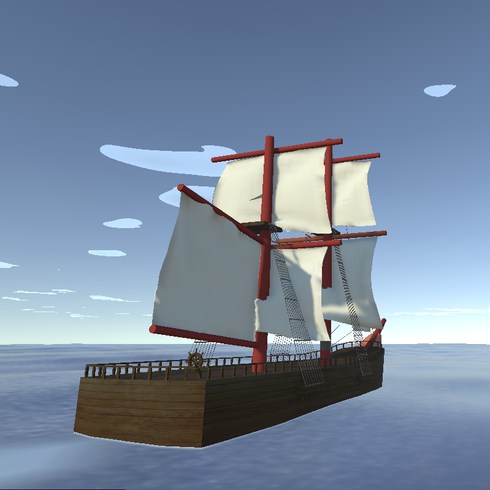

This is a small unity test project that I started because I was really curious about the way water is simulated in modern games.
I initially followed [Catlike Coding's Flow/Waves tutorial](https://catlikecoding.com/unity/tutorials/flow/waves/)
However, this only explained the basic logic for the visuals, so I expanded upon the concept using other guides to include buoyancy simulation, a basic weather system and make the water look better.

* Unity 6.3.10f1
* Universal Render Pipeline (URP)
  
It will keep getting updated as I come up with new ideas and improvements.
